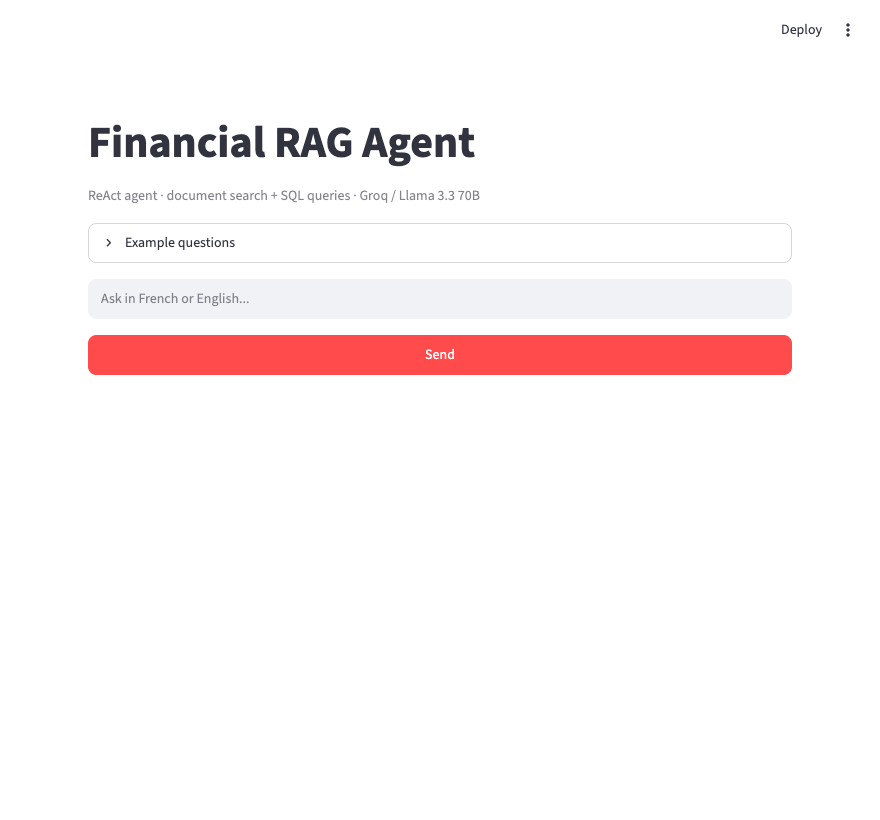

# Financial RAG Agent

An agentic RAG system that answers questions about financial risk data using two tools:

- **Document search (RAG)** — semantic search over indexed reports and methodology docs (ChromaDB + sentence-transformers)
- **SQL queries** — direct queries on a SQLite database of 30,000 scored clients

The agent (ReAct / LangGraph) decides which tool to use based on the question. Answers in French or English.



## Stack

Python · LangChain · LangGraph · ChromaDB · Groq (Llama 3.3 70B) · Streamlit · sentence-transformers

## Setup

```bash
python -m venv .venv && source .venv/bin/activate
pip install -r requirements.txt
```

Create a `.env` file:
```
GROQ_API_KEY=your_key_here
```

Get a free key at [console.groq.com](https://console.groq.com).

## Usage

```bash
# Index documents (run once)
python ingest.py

# Launch the dashboard
streamlit run app.py
```

## Example questions

- *What is the AUC score for fraud detection?* → RAG on reports
- *Quel est le taux de défaut moyen par décile de risque ?* → SQL on scored clients
- *How many anomalies per education level?* → SQL aggregation
- *Quelle est la méthodologie de scoring ?* → RAG on methodology docs

## Data

The SQL tool connects to the `scored_clients` table from the [spf-risk-scoring](https://github.com/Proftg/spf-risk-scoring) project (30k clients, Isolation Forest scoring).
